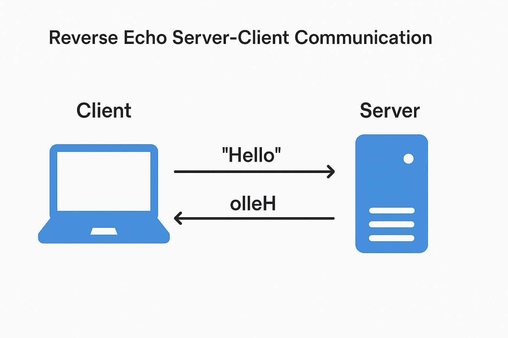
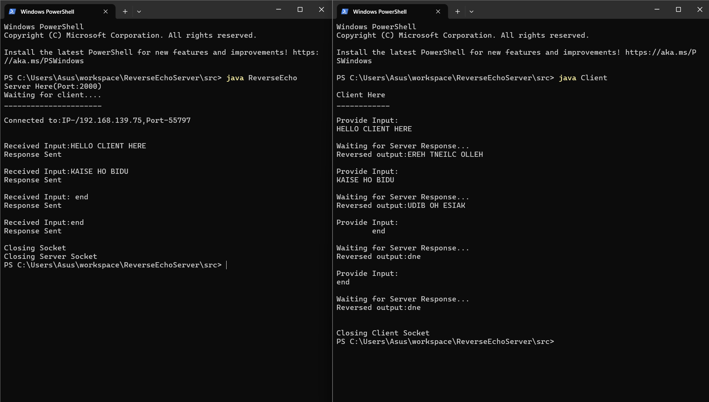

# 🔁 Reverse Echo Server-Client using Java TCP Sockets

This is a simple Java-based socket programming project that demonstrates a TCP-based client-server system. The server receives input from the client, reverses the message, waits for a few seconds (to simulate processing), and then sends the reversed message back to the client.

---

## 📡 What is Socket Programming?

**Socket programming** is a way to enable communication between two machines over a network. In Java, this involves:

- 🧱 A **ServerSocket** that listens on a specific port
- 🔌 A **Socket** on the client side to connect to the server
- 📬 **Input/Output streams** to send and receive data

This project uses **TCP sockets**, which means the communication is **connection-oriented**, reliable, and data is received in order.

---

## 🖼️ Architecture: Client-Server Reverse Echo

The following diagram shows how the client and server interact:

1. Server starts and listens on a port (`2000`)
2. Client connects to the server
3. Client sends a message
4. Server reverses the message and returns it
5. Communication ends when the message `"end"` is sent

---

## 💻 How It Works

Here’s a snapshot of the actual working:

- Client sends `hello`
- Server returns `olleh`
- Communication continues until `end` (which becomes `dne` reversed)

---

## 🧠 Key Concepts Demonstrated

| Concept | Description |
|--------|-------------|
| `ServerSocket` | Accepts incoming TCP connections |
| `Socket` | Used by both client and server to exchange data |
| `BufferedReader` / `PrintStream` | For input and output stream handling |
| `Thread.sleep()` | Simulates server delay |
| `try-with-resources` | Ensures clean closing of sockets and streams |

---

---

## 🚀 How to Run

### ✅ Compile the Java files:

javac ReverseEcho.java

javac Client.java
